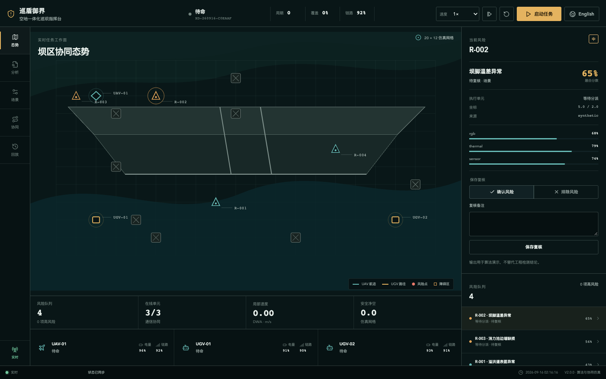

# Xundun Yujie | Integrated Air-Ground Dam Patrol System

[中文](README.md) · `V2.0.0` · Apache-2.0

Xundun Yujie is a reproducible software project for dam-area inspection. V2.0.0 combines multimodal algorithm analysis, UAV–UGV coordination, configurable 2D simulation, mission replay, and a bilingual command console. It demonstrates the complete workflow with synthetic data and requires neither physical hardware nor an external cloud service.



## Capabilities

| Workspace | Runnable capability |
| --- | --- |
| Situation | 2D dam map, device tracks, planned paths, risks, obstacles, links, and live events |
| Analysis | RGB images, thermal CSV, sensor CSV, short MP4 analysis, and quality-weighted fusion |
| Scenarios | Routine inspection, rainfall seepage, communication degradation, and dynamic obstacles |
| Coordination | Hungarian versus greedy assignment, A* versus Dijkstra, DWA avoidance, and aerial relay |
| Replay | Mission history, event timeline, risk review, JSON/CSV export, and browser print report |

The UI switches between Chinese and English, with the preference stored under `xundun.locale`. The principal V1.1.0 endpoints remain available for existing clients.

## One-command Docker start

Docker and Docker Compose are required. The frontend and backend run as one service on one port.

```bash
docker compose up --build
```

Open `http://localhost:8000`. The SQLite database and derived artifacts are stored in the `xundun-runtime` named volume. Stop the service with:

```bash
docker compose down
```

Use `docker compose down -v` only when you also intend to delete local runtime data.

## Local development

Python 3.12, Node.js 22, and pnpm are recommended.

```bash
python3 -m venv .venv
source .venv/bin/activate
pip install -r requirements.txt
cd frontend
pnpm install
pnpm build
cd ..
python backend/server.py
```

FastAPI serves the production frontend at `http://127.0.0.1:8000`. For frontend hot reload, run this in a second terminal:

```bash
cd frontend
pnpm dev
```

Vite listens on `http://127.0.0.1:5173` and proxies `/api` to the backend.

## Synthetic samples

`data/samples` contains project-generated demonstration inputs:

- `surface-anomaly.png`: an image with surface-anomaly candidates.
- `thermal.csv`: a two-dimensional temperature matrix.
- `sensor.csv`: a time series with `timestamp,value` columns.
- `patrol.mp4`: a short patrol clip.

The Analysis workspace can run the multimodal or video sample directly. Identical inputs, parameters, and seeds produce identical results.

## Algorithm logic

### RGB images and short video

The RGB pipeline performs normalization, CLAHE, Canny, Sobel, morphological closing, and connected-component extraction. It returns image quality, contrast, edge density, candidate boxes, area, linearity, and anomaly scores. Video is sampled at 2 FPS for at most 120 frames; the system returns a frame-level risk curve and up to five non-duplicate high-risk annotated keyframes.

The output is described as a surface-anomaly candidate, not an engineering crack diagnosis.

### Thermal and sensor data

Thermal analysis uses the median, median absolute deviation, and robust Z-scores to locate connected hot or cold regions. The sensor pipeline sorts and deduplicates timestamps, resamples to uniform intervals, detrends and standardizes values, then applies FFT energy analysis and CUSUM change-point detection.

### Multimodal fusion

Base weights are `0.45` for RGB/video, `0.30` for thermal data, and `0.25` for sensor data. Each anomaly score is multiplied by its data-quality score. Missing modalities are removed and the remaining weights are normalized.

```text
Low:    score < 0.45
Medium: 0.45 <= score < 0.70
High:   score >= 0.70
```

### Air-ground coordination

The fixed fleet contains one UAV and two UGVs. The simulation executes Hungarian assignment and A* global paths while retaining greedy-assignment and Dijkstra metrics for comparison. DWA samples trajectories in the current velocity window to handle dynamic obstacles. When link quality falls below 60, the UAV enters relay duty; below 35, affected UGVs wait, go offline, or have unfinished work reassigned.

Each of the four scenarios exposes the seed, risk count, obstacle count, initial link quality, and simulation speed.

## Input limits

| Input | Format | Limit |
| --- | --- | --- |
| RGB image | JPEG or PNG | 20 MB |
| Thermal data | Numeric CSV matrix | 5 MB |
| Sensor data | CSV with at least `timestamp,value` | 5 MB |
| Short video | MP4 | 100 MB and 60 seconds |

An RGB image and video are mutually exclusive; thermal and sensor data may accompany either. Uploads are streamed, hashed with SHA-256, and checked by extension, MIME type, and actual decoding. Original uploads are deleted immediately after success or failure. The database keeps only metadata, hashes, parameters, structured results, and permitted annotated thumbnails or keyframes.

## API summary

| Method | Endpoint | Purpose |
| --- | --- | --- |
| `GET` | `/api/health` | Health and version |
| `GET` | `/api/v2/scenarios` | Four scenario templates |
| `GET / POST` | `/api/v2/missions` | List or create missions |
| `POST` | `/api/v2/missions/{id}/commands` | Start, pause, step, reset, or set speed |
| `GET` | `/api/v2/missions/{id}/events` | Replay events and snapshots |
| `GET` | `/api/v2/missions/{id}/comparisons` | Assignment, path, and DWA metrics |
| `POST` | `/api/v2/analyses` | Upload and enqueue analysis |
| `GET` | `/api/v2/analyses/{id}` | Read progress and results |
| `WS` | `/api/v2/missions/{id}/stream` | Snapshots, events, progress, and heartbeat |

Create a mission:

```bash
curl -X POST http://localhost:8000/api/v2/missions \
  -H 'Content-Type: application/json' \
  -d '{"scenario_id":"rainfall-seepage","seed":20260915,"parameters":{"risk_count":5,"obstacle_count":8,"link_quality":82}}'
```

Exports are available at:

```text
/api/v2/missions/{id}/export.json
/api/v2/missions/{id}/export.csv?dataset=risks
/api/v2/missions/{id}/export.csv?dataset=events
/api/v2/missions/{id}/export.csv?dataset=comparisons
```

Use `/?view=report&mission={id}` for the browser print report. The server does not generate PDF files; the browser can save the report as PDF.

## Project layout

```text
backend/             FastAPI, analysis algorithms, coordination, and SQLite
frontend/src/        React console, API client, bilingual text, and styles
data/scenarios.json  Four deterministic scenarios
data/samples/        Project-generated synthetic inputs
runtime/             Ignored local database and derived artifacts
Dockerfile           Frontend build and backend runtime image
compose.yaml         Single-service configuration
```

## Technical boundaries

- This release demonstrates algorithm logic and air-ground coordination simulation; it does not include hardware control, ROS nodes, or device drivers.
- It includes no trained model or model weights and calls no external recognition service.
- It includes no real hydraulic-engineering data, engineering safety certification, or production safety assurance.
- Results do not replace professional hydraulic inspection, structural safety assessment, or field-response decisions.
- Real-device integration requires separate access control, auditing, cybersecurity, fail-safe design, and on-site validation.

Project attribution: Southwest University.

## License

Licensed under the [Apache License 2.0](LICENSE). Copyright 2026 Southwest University.
